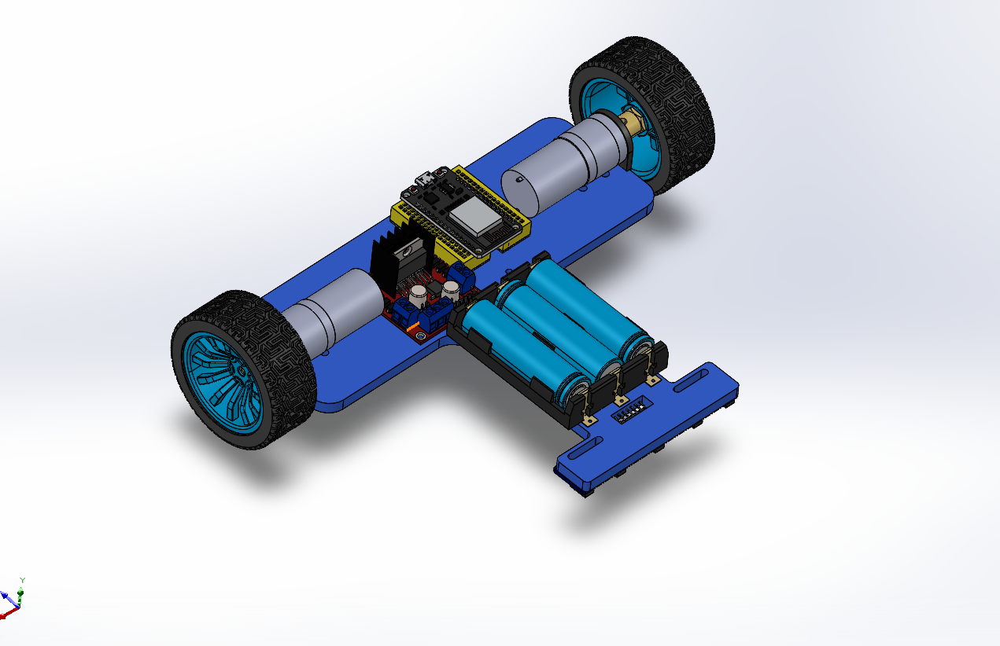
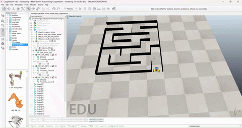

# Mobile Robots Projects using CoppeliaSim

This repository contains a collection of projects developed for the **Mobile Robots (MAM331)** course at **Benha University – Faculty of Engineering**.

The projects combine simulation, embedded systems, control algorithms, sensor integration, and autonomous navigation concepts using both hardware implementation and CoppeliaSim environments.

---

## Projects Included

### 1. Line Follower Robot

An autonomous robot capable of tracking a predefined path using:

- 5 TCRT5000 Line Sensors
- PID Control Algorithm
- Arduino Uno
- L298N Motor Driver
- Differential Drive System

#### Features

- PID-based line tracking
- Automatic line recovery
- Smart calibration routine
- Sharp turn handling
- T-intersection handling
- Crossroad detection
- High-speed operation

---

### Hardware Implementation

---

### CAD Design

---

### Line Follower Simulation

---

## 2. Maze Solver Robot

A simulated autonomous robot capable of navigating and solving maze environments using distance sensors and decision-making algorithms.

### Features

- Obstacle detection
- Autonomous navigation
- Wall-following strategy
- Maze exploration
- Real-time sensor processing

---

### Maze Solver Demonstration

---

## Hardware Components

| Component | Description |
|------------|------------|
| Arduino Uno | Main Controller |
| L298N | Motor Driver |
| JGA25-370 Motors | Differential Drive Motors |
| TCRT5000 Sensors | Line Detection |
| Li-ion Battery Pack | Power Supply |
| Caster Wheel | Passive Support |

---

## Software & Tools

- Arduino IDE
- Embedded C/C++
- PID Control
- CoppeliaSim
- SolidWorks
- Mobile Robotics

---

## Control Strategy

The line follower robot uses a PID controller to minimize tracking error and maintain stable movement along the line.

Implemented terms:

- Proportional (P)
- Integral (I)
- Derivative (D)

The controller dynamically adjusts motor speeds according to sensor readings and path curvature.

---

## Development Workflow

1. Mechanical Design
2. CAD Modeling
3. Hardware Assembly
4. Sensor Integration
5. Arduino Programming
6. PID Tuning
7. CoppeliaSim Modeling
8. Simulation Testing
9. Validation

---

## Course

Mobile Robots (MAM331)

Faculty of Engineering  
Benha University

---

## Supervision

Dr. Muhammed Gaafar

Eng. Ahmed Adel Ghoneimy

---

## Team Members

- Mahmoud Mohamed Shamekh
- Youssef Ayad
- Mohsen Hany Mohsen
- Barthinia Hany

---

## Keywords

Mobile Robots • Robotics • PID Control • Arduino • CoppeliaSim • Maze Solver • Line Follower • Autonomous Navigation • Mechatronics • Engineering
